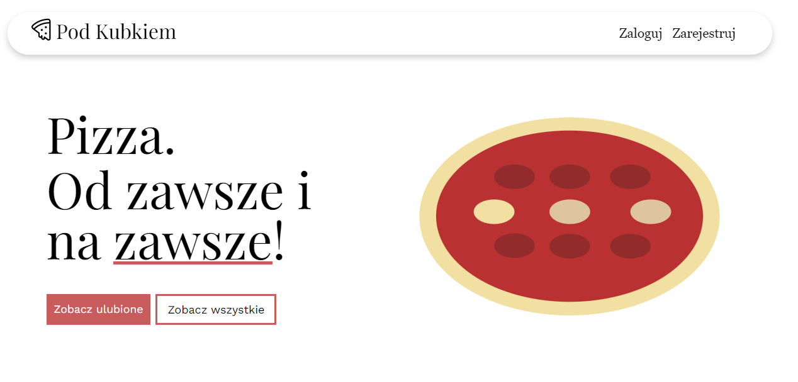

# Pizza web app

The app is used for adding pizza to your favorite. You can add and view them after logging in.

### User can
* See all the pizzas (only margherita and hawaiian at the moment)
* Login or register (information are saved in a cookie. *yes, I know, very safe 😄*)
* Add a pizza to the favorite list (only if the user is logged in. Information are ofc saved in a cookie)
* View favorite
* See a cookie warning only once per session

### Made with
* Figma (fig file included)
* PHP
* Bootstrap

*This app was a school project that i and two of my fiends were asigned (that's why the app is in Polish). We were supposed to build a website about choosen subject and use PHP and cookies*

